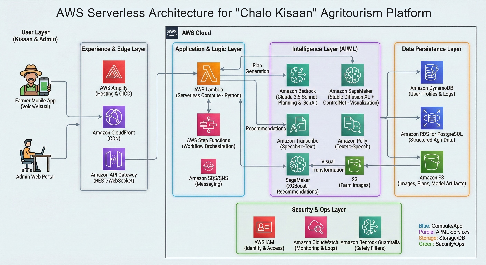
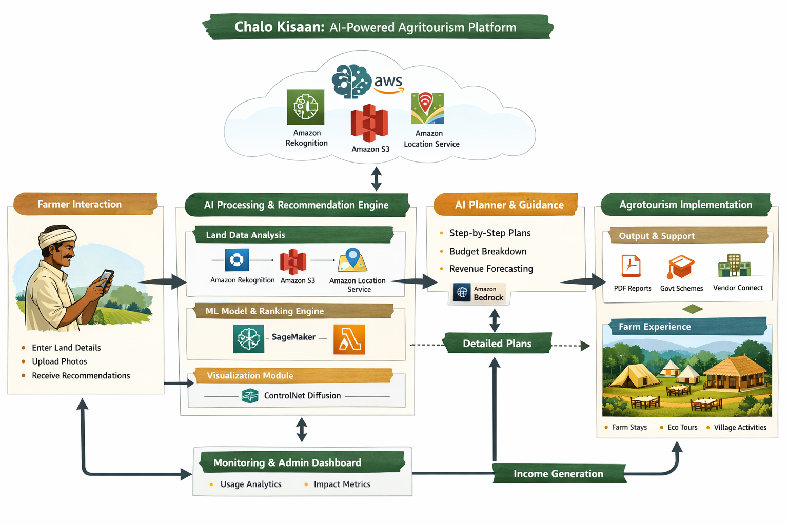

# Chalo Kisaan - Agritourism PWA


## Overview

**Chalo Kisaan** is a Progressive Web Application (PWA) designed to empower small-scale farmers across India to establish and scale profitable agritourism businesses. By combining voice-first interfaces, artificial intelligence, and offline-first architecture, Chalo Kisaan bridges the gap between traditional farming and modern tourism entrepreneurship.

The platform addresses a critical market need: while millions of Indian farmers possess valuable agricultural land, many lack the business acumen, technical skills, and visualization capabilities to convert their farms into successful tourism destinations. Chalo Kisaan democratizes agritourism by making business planning accessible through voice interaction in local languages (Hindi, Marathi, English).

---

## Key Features

### 🎤 Voice-First Onboarding
- **Multi-language support**: Hindi, Marathi, and English
- **Tap-to-speak interface**: Designed for users with limited digital literacy
- **Intelligent extraction**: Automatically parses farm details (land size, crops, budget, amenities) from natural speech
- **Offline-capable**: Works without internet connectivity

### 🤖 AI Business Consultant
- **Structured business plans**: Generated using AWS Bedrock LLM
- **Comprehensive analysis**:
  - Itemized setup costs breakdown
  - Hour-by-hour daily guest itineraries
  - ROI calculations with break-even timelines
  - Annual profit projections
- **Visual-first design**: Card-based UI with charts, not text-heavy paragraphs
- **Iterative refinement**: Regenerate plans as farm details evolve

### 🎨 Dream Visualization
- **Generative AI overlay**: AWS SageMaker-powered infrastructure visualization
- **Before/After comparison**: Interactive slider to compare original and enhanced farm images
- **Realistic rendering**: Preserves original landscape while overlaying tourism infrastructure
- **Multiple styles**: Traditional, modern, and eco-friendly design options

### 📱 Offline-First Architecture
- **Complete offline functionality**: Access all saved projects without internet
- **Automatic synchronization**: Seamless sync when connectivity is restored
- **Conflict resolution**: Last-write-wins strategy for multi-device scenarios
- **50MB+ local storage**: Support for multiple projects with images

### 📊 Dashboard & Professional Reporting
- **Project management**: Save, organize, and manage multiple agritourism projects
- **Summary metrics**: Quick view of setup costs, projected profits, and break-even timelines
- **Professional PDF export**: Bank-ready business plan documents with:
  - Executive summary
  - Itemized cost breakdowns
  - Daily operational schedules
  - Financial projections and ROI analysis
  - Assumptions and methodology

### 🔄 Cross-Device Synchronization
- **PWA installation**: Install as native app on iOS and Android
- **Real-time sync**: Changes propagate across devices within 5 seconds
- **Seamless experience**: Last viewed project auto-loads on app launch

### 🔒 Enterprise-Grade Security
- **End-to-end encryption**: AES-256 for local storage, TLS 1.3 for transit
- **Data privacy**: Compliant with Indian data protection standards
- **Session management**: Automatic logout after 30 minutes of inactivity
- **Audit logging**: Track all data access and modifications

---

## Architecture

### System Architecture



The Chalo Kisaan platform is built on a modern, scalable architecture:

**Frontend Layer**:
- React 18+ with TypeScript for type-safe UI development
- Redux for predictable state management
- Service Worker for offline support and background sync
- IndexedDB for efficient local data persistence
- Responsive design optimized for 2GB RAM devices

**Backend Layer**:
- Python FastAPI for high-performance async API handling
- PostgreSQL for reliable data persistence
- SQLAlchemy ORM for database abstraction
- Pydantic for robust data validation

**AI/ML Services**:
- **AWS Transcribe**: Multi-language speech-to-text (Hindi, Marathi, English)
- **AWS Bedrock**: LLM-powered business plan generation
- **AWS SageMaker**: Generative AI for farm visualization
- **AWS S3**: Scalable image and PDF storage
- **AWS Cognito**: Secure user authentication

### Process Flow



The user journey follows a streamlined workflow:

1. **Onboarding**: Farmer provides farm details via voice interface
2. **Planning**: AI generates comprehensive business plan
3. **Visualization**: AI creates dream visualization of farm infrastructure
4. **Review**: Farmer reviews and refines plan and visualizations
5. **Export**: Download professional PDF for bank applications
6. **Sync**: All data automatically syncs across devices

---

## Technology Stack

### Frontend
| Technology | Purpose |
|-----------|---------|
| React 18+ | UI framework with hooks and concurrent features |
| TypeScript | Type-safe development |
| Redux | Global state management |
| Vite | Fast build tooling and dev server |
| Service Worker | Offline support and background sync |
| IndexedDB | Local data persistence (50MB+) |
| fast-check | Property-based testing |
| Vitest | Unit testing framework |

### Backend
| Technology | Purpose |
|-----------|---------|
| Python 3.10+ | Server-side runtime |
| FastAPI | High-performance async web framework |
| Pydantic | Data validation and serialization |
| SQLAlchemy | ORM for database abstraction |
| PostgreSQL | Relational database |
| pytest | Testing framework |
| hypothesis | Property-based testing |

### AWS Services
| Service | Purpose |
|---------|---------|
| AWS Transcribe | Speech-to-text conversion (multi-language) |
| AWS Bedrock | LLM for business plan generation |
| AWS SageMaker | Generative AI for image visualization |
| AWS S3 | Image and PDF storage |
| AWS Cognito | User authentication and authorization |
| AWS CloudFront | CDN for static asset delivery |

---

## Getting Started

### Prerequisites

- Node.js 18+ and npm/yarn
- Python 3.10+
- AWS account with configured credentials
- PostgreSQL 12+

### Installation

#### Frontend Setup

```bash
# Clone the repository
git clone https://github.com/jishanahmed-shaikh/chalo-kisaan.git
cd chalo-kisaan

# Install dependencies
npm install

# Configure environment variables
cp .env.example .env.local
# Edit .env.local with your AWS credentials and API endpoints

# Start development server
npm run dev

# Build for production
npm run build

# Run tests
npm run test
npm run test:pbt  # Property-based tests
```

#### Backend Setup

```bash
# Navigate to backend directory
cd backend

# Create virtual environment
python -m venv venv
source venv/bin/activate  # On Windows: venv\Scripts\activate

# Install dependencies
pip install -r requirements.txt

# Configure environment variables
cp .env.example .env
# Edit .env with your AWS credentials and database URL

# Run migrations
alembic upgrade head

# Start development server
uvicorn main:app --reload

# Run tests
pytest
pytest --hypothesis-seed=0  # Property-based tests
```

### Configuration

#### AWS Credentials

Set up AWS credentials in your environment:

```bash
export AWS_ACCESS_KEY_ID=your_access_key
export AWS_SECRET_ACCESS_KEY=your_secret_key
export AWS_REGION=ap-south-1  # India region
```

#### Database Setup

```bash
# Create PostgreSQL database
createdb chalo_kisaan

# Run migrations
alembic upgrade head
```

---

## Project Structure

```
chalo-kisaan/
├── frontend/                    # React PWA application
│   ├── src/
│   │   ├── components/         # React components
│   │   ├── pages/              # Page components
│   │   ├── store/              # Redux store
│   │   ├── services/           # API and utility services
│   │   ├── hooks/              # Custom React hooks
│   │   ├── types/              # TypeScript interfaces
│   │   └── App.tsx             # Root component
│   ├── public/                 # Static assets
│   ├── vite.config.ts          # Vite configuration
│   └── package.json
│
├── backend/                     # FastAPI backend
│   ├── app/
│   │   ├── api/                # API endpoints
│   │   ├── models/             # Database models
│   │   ├── schemas/            # Pydantic schemas
│   │   ├── services/           # Business logic
│   │   ├── utils/              # Utility functions
│   │   └── main.py             # FastAPI app
│   ├── migrations/             # Alembic migrations
│   ├── tests/                  # Test suite
│   ├── requirements.txt        # Python dependencies
│   └── .env.example
│
├── .kiro/
│   └── specs/
│       └── chalo-kisaan/       # Specification documents
│           ├── requirements.md # Detailed requirements
│           ├── design.md       # Technical design
│           └── tasks.md        # Implementation tasks
│
├── media/                       # Logos and diagrams
│   ├── Logo-Primary.png
│   ├── ProcessFlow-UseCaseDiagram.png
│   └── Technical_Architecture.png
│
├── README.md                    # This file
├── CONTRIBUTING.md             # Contribution guidelines
└── LICENSE                      # MIT License
```

---

## Core Specifications

### Requirements

The system is built on 10 major requirement categories covering 100+ acceptance criteria:

1. **Voice-First Onboarding**: Multi-language voice input with auto-form filling
2. **AI Business Consultant**: LLM-powered business plan generation
3. **Dream Visualization**: Generative AI farm infrastructure overlay
4. **Offline Capabilities**: Complete offline-first functionality
5. **Dashboard & Reporting**: Project management and PDF export
6. **PWA Installation**: Native app experience on mobile devices
7. **Data Security**: Enterprise-grade encryption and privacy
8. **Error Handling**: Comprehensive error recovery mechanisms
9. **Accessibility**: Support for low-literacy users and screen readers
10. **Performance**: Optimized for low-end devices and slow connections

### Design Principles

- **Mobile-First**: Optimized for 2GB RAM devices with slow connections
- **Offline-First**: All critical functionality works without internet
- **Voice-Primary**: Voice is the primary interaction method
- **Visual-Heavy**: Minimal text, maximum use of cards and charts
- **Accessibility**: Support for screen readers and large touch targets
- **Resilience**: Graceful degradation and automatic retry mechanisms

### Correctness Properties

The system is validated against 36 formal correctness properties covering:
- Voice recording state consistency
- Data persistence round-trips
- Offline functionality
- Cross-device synchronization
- Error handling and recovery
- Accessibility compliance
- Performance benchmarks

---

## Implementation Roadmap

### Phase 1: Core Infrastructure (Weeks 1-2)
- [ ] Project setup and build configuration
- [ ] Database schema and migrations
- [ ] Core data models and validation
- [ ] Testing infrastructure setup

### Phase 2: Voice Onboarding (Weeks 3-4)
- [ ] Voice recording UI component
- [ ] AWS Transcribe integration
- [ ] Farm details extraction
- [ ] Form validation and persistence

### Phase 3: AI Business Planning (Weeks 5-6)
- [ ] AWS Bedrock integration
- [ ] Business plan generation
- [ ] Card-based UI components
- [ ] ROI calculator and charts

### Phase 4: Dream Visualization (Weeks 7-8)
- [ ] Image upload and validation
- [ ] AWS SageMaker integration
- [ ] Before/After slider component
- [ ] Image persistence and download

### Phase 5: Offline & Sync (Weeks 9-10)
- [ ] IndexedDB storage layer
- [ ] Service Worker implementation
- [ ] Sync queue and conflict resolution
- [ ] Cross-device synchronization

### Phase 6: Dashboard & Reporting (Weeks 11-12)
- [ ] Dashboard UI and project listing
- [ ] PDF generation and export
- [ ] Project management features
- [ ] Professional report formatting

### Phase 7: Security & Polish (Weeks 13-14)
- [ ] Data encryption implementation
- [ ] Session management
- [ ] Error handling and recovery
- [ ] Performance optimization

### Phase 8: Testing & Deployment (Weeks 15-16)
- [ ] End-to-end testing
- [ ] Property-based test validation
- [ ] Performance benchmarking
- [ ] Production deployment

---

## Testing Strategy

### Unit Tests
- 80% code coverage target
- Specific examples and edge cases
- Integration point testing
- UI interaction testing

### Property-Based Tests
- All 36 correctness properties covered
- Minimum 100 iterations per property
- fast-check for frontend (JavaScript)
- hypothesis for backend (Python)

### Integration Tests
- Complete user workflows
- Cross-feature interactions
- Offline-to-online transitions
- Multi-device synchronization

### End-to-End Tests
- Full user journeys
- Critical business workflows
- Performance benchmarks
- Accessibility compliance

---

## Performance Targets

| Metric | Target |
|--------|--------|
| Initial Load Time | < 3 seconds (4G) |
| Voice Transcription | < 10 seconds |
| Business Plan Generation | < 30 seconds |
| Visualization Generation | < 60 seconds |
| PDF Export | < 30 seconds |
| Cross-Device Sync | < 5 seconds |
| Local Storage Capacity | 50MB+ |
| Minimum Device RAM | 2GB |
| Supported Connection | 2G+ |

---

## Security & Compliance

### Data Protection
- **Encryption at Rest**: AES-256 for local storage
- **Encryption in Transit**: TLS 1.3 for all network communications
- **Authentication**: JWT tokens with 1-hour expiry
- **Authorization**: Row-level security for user data

### Privacy
- **Compliance**: Indian data protection standards
- **Audit Logging**: Track all data access and modifications
- **User Consent**: Explicit opt-in for error logging
- **Data Deletion**: Permanent removal on user request

### Session Management
- **Automatic Logout**: 30 minutes of inactivity
- **Token Revocation**: Immediate on logout
- **Multi-Device**: Secure cross-device synchronization
- **Conflict Resolution**: Last-write-wins strategy

---

## Contributing

We welcome contributions from developers, designers, and domain experts. Please see [CONTRIBUTING.md](CONTRIBUTING.md) for guidelines on:

- Code style and standards
- Testing requirements
- Commit message conventions
- Pull request process
- Community code of conduct

---

## Support & Documentation

### Documentation
- [Requirements Document](.kiro/specs/chalo-kisaan/requirements.md) - Detailed acceptance criteria
- [Design Document](.kiro/specs/chalo-kisaan/design.md) - Technical architecture and design decisions
- [Implementation Tasks](.kiro/specs/chalo-kisaan/tasks.md) - Detailed task breakdown and roadmap

### Getting Help
- **Issues**: Report bugs and request features on GitHub Issues
- **Discussions**: Join community discussions on GitHub Discussions
- **Email**: Contact the team at support@chalokisaan.com

---

## Roadmap

### Q1 2026
- [ ] MVP launch with core features
- [ ] Voice onboarding in Hindi and Marathi
- [ ] Basic business plan generation
- [ ] Offline functionality

### Q2 2026
- [ ] Dream visualization feature
- [ ] Cross-device synchronization
- [ ] Professional PDF export
- [ ] Mobile app optimization

### Q3 2026
- [ ] Advanced analytics dashboard
- [ ] Multi-language support expansion
- [ ] Integration with banking partners
- [ ] Farmer community features

### Q4 2026
- [ ] AI-powered recommendations
- [ ] Seasonal planning features
- [ ] Market price integration
- [ ] Government scheme integration

---

## License

Chalo Kisaan is licensed under the MIT License. See [LICENSE](LICENSE) file for details.

---

## Acknowledgments

This project is built with support from:
- AWS for cloud infrastructure and AI services
- The Indian farming community for inspiration and feedback
- Open-source contributors and the developer community

---

## Contact & Social

- **Website**: https://www.jishanahmed.in
- **Email**: shaikhjishan255@gmail.com
- **LinkedIn**: [Jishanahmed AR Shaikh](https://linkedin.comin/jishanahmedshaikh)
- **GitHub**: [chalo-kisaan](https://github.com/jishanahmed-shaikh/chalo-kisaan)

---

**Made with ❤️ for Indian Farmers**

*Empowering agricultural entrepreneurship through technology and innovation.*
